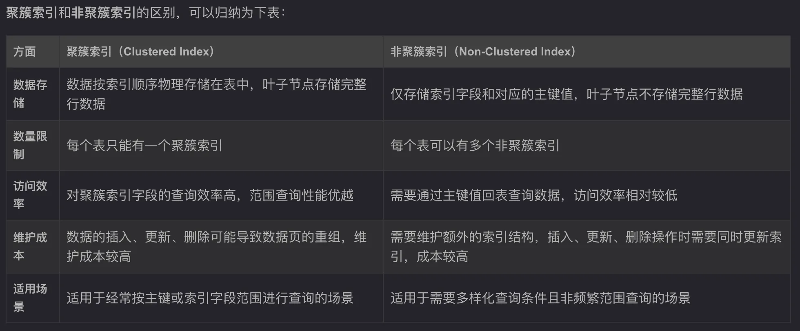

### 1、聚簇索引
聚簇索引（Clustered Index）是指表中的主键，它决定了表中数据的物理存储顺序。在 InnoDB 中，表的主键默认就是聚簇索引。如果没有显式定义主键，InnoDB 会选择一个唯一的非空索引作为聚簇索引；如果没有任何合适的索引，InnoDB 会隐式创建一个行ID作为聚簇索引。
聚簇索引使用 B+ 树结构存储数据。树的叶子节点直接存储完整的行数据。因此，聚簇索引既是索引又是数据存储的一部分。
聚簇索引的特点：
- 唯一性：每个表只能有一个聚簇索引，因为数据行只能按照一种顺序存储。
- 访问效率：对于基于聚簇索引的范围查询，性能较高，因为相关数据物理上是连续存储的。
- 维护成本：插入、更新或删除操作可能需要重新组织数据页，成本较高，尤其是当插入位置不在表尾时。

### 2、非聚簇索引
非聚簇索引（Non-Clustered Index）是指除聚簇索引之外的所有索引。在 InnoDB 中，非聚簇索引的叶子节点不存储完整的行数据，而是存储聚簇索引的主键值作为指向实际数据的引用。
非聚簇索引同样使用 B+ 树结构，但叶子节点只包含索引字段和对应的主键值。通过主键值，进一步查找聚簇索引以获取完整行数据。
非聚簇索引的特点：
-  多索引支持：一个表可以有多个非聚簇索引，以支持多种查询条件。
- 访问路径：首先通过非聚簇索引定位到主键，然后通过主键查询聚簇索引获取完整数据。这可能涉及两次查找（索引查找 + 聚簇查找）。
- 维护成本：非聚簇索引需要维护额外的索引结构，插入、更新或删除操作时需要同时更新这些索引，增加了维护成本。

### 3、两者区别

### 4、注意事项
在实际工作中，对于聚簇索引和非聚簇索引的使用，需要注意以下几点：
- 选择合适的主键：由于聚簇索引决定了数据的物理存储顺序，选择一个唯一且不频繁变动的主键非常重要。例如，自增主键（如 AUTO_INCREMENT）通常是一个不错的选择，因为它能够避免频繁的页分裂和数据重新排列。
- 优化二级索引：由于非聚簇索引依赖于聚簇索引（主键）来定位数据，选择合适的主键有助于提高非聚簇索引的查询性能。此外，尽量减少非聚簇索引的数量，以降低维护成本。
- 考虑数据插入模式：如果数据主要是按主键的顺序插入（如自增主键），可以减少数据页的分裂和碎片，提高插入性能。
- 复合索引的使用：对于需要根据多个列进行查询的场景，可以创建复合非聚簇索引（如 (col1, col2)），以覆盖更多的查询需求，提高查询效率。